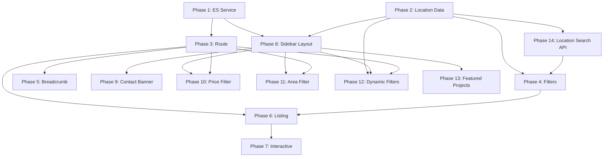

# Listing Page Implementation Plan

## Overview
Build property listing/catalog page with complex filtering system using Astro hybrid SSG/SSR approach.

**Key Architecture:**
- **Hybrid Rendering:** SSR for listing/search + SSG for sidebar components
- **SSR:** Listing with Elasticsearch queries (dynamic filters)
- **SSG:** Sidebar (price/area filters, contact banner, featured projects)
- Direct database queries (PostgreSQL + ElasticSearch)
- URL pattern from v1: `/mua-ban/ha-noi/gia-tu-1-ty-den-2-ty?property_types=12,13&...`
- No REST API - query DB directly in Astro components

## Status: In Progress (Core Complete)
**Created:** 2026-02-07
**Updated:** 2026-02-07
**Branch:** listing72
**Priority:** High

## Phases

### Phase 1: ElasticSearch Service Layer (SSR)
**File:** [phase-01-elasticsearch-service.md](./phase-01-elasticsearch-service.md)
**Status:** ✅ Complete
**Priority:** High (Foundation)
**Rendering:** SSR

- Create ElasticSearch client service
- Implement query builder for filters
- Index mapping for properties
- Vietnamese text search

### Phase 2: Location Data Service (SSG)
**File:** [phase-02-location-data-service.md](./phase-02-location-data-service.md)
**Status:** Pending
**Priority:** High (Data Layer)
**Rendering:** SSG (Build-time data generation)

- Load provinces/districts from DB at build time
- Create location lookup service
- Generate static location data
- Client-side multi-select logic

### Phase 3: Dynamic Route & URL Parsing (SSR)
**File:** [phase-03-dynamic-route-url-parsing.md](./phase-03-dynamic-route-url-parsing.md)
**Status:** Pending
**Priority:** High (Routing)
**Rendering:** SSR (Dynamic routing)

- Create `[...slug].astro` dynamic route
- Parse URL segments (mua-ban/ha-noi/gia-...)
- Query param extraction
- URL builder utility

### Phase 4: Filter Section UI
**File:** [phase-04-filter-section-ui.md](./phase-04-filter-section-ui.md)
**Status:** Pending
**Priority:** Medium (UI)

- Filter component (loại hình, giá, diện tích, địa điểm)
- Advanced filters (bedrooms, bathrooms, radius)
- Apply/Clear buttons
- Client-side state management

### Phase 5: Breadcrumb Section
**File:** [phase-05-breadcrumb-section.md](./phase-05-breadcrumb-section.md)
**Status:** Pending
**Priority:** Low (UI Enhancement)

- Dynamic breadcrumb generation
- URL-based navigation path
- Schema.org structured data

### Phase 6: Listing Section & Pagination (SSR)
**File:** [phase-06-listing-section-pagination.md](./phase-06-listing-section-pagination.md)
**Status:** Pending
**Priority:** High (Core Feature)
**Rendering:** SSR (Dynamic listing data)

- Property cards grid
- Sort dropdown
- Server-side pagination
- Result count display
- Posted time calculation

### Phase 7: Interactive Features
**File:** [phase-07-interactive-features.md](./phase-07-interactive-features.md)
**Status:** Pending
**Priority:** Low (Enhancement)

- Favorite button (with auth check)
- Compare button
- Share button (social + copy link)
- Client-side interactions

### Phase 8: Sidebar Structure & Layout (SSG)
**File:** [phase-08-sidebar-structure-layout.md](./phase-08-sidebar-structure-layout.md)
**Status:** Pending
**Priority:** Medium (UI Foundation)
**Rendering:** SSG (Static layout)

- Right sidebar layout (25% width)
- Sticky positioning on scroll
- Responsive stacking (mobile)
- Card container structure

### Phase 9: Quick Contact Banner (SSG)
**File:** [phase-09-quick-contact-banner.md](./phase-09-quick-contact-banner.md)
**Status:** Pending
**Priority:** Medium (Sidebar Widget)
**Rendering:** SSG (Static from env)

- Display email and phone
- "Gọi ngay" call button
- "Nhắn tin qua Zalo" button
- Contact info from environment

### Phase 10: Price Range Filter Card (SSG)
**File:** [phase-10-price-range-filter-card.md](./phase-10-price-range-filter-card.md)
**Status:** Pending
**Priority:** High (Core Filter)
**Rendering:** SSG (13 static ranges)

- 13 predefined price ranges
- Custom min/max price inputs
- URL parameter generation
- Active range highlighting

### Phase 11: Area Filter Card (SSG)
**File:** [phase-11-area-filter-card.md](./phase-11-area-filter-card.md)
**Status:** Pending
**Priority:** High (Core Filter)
**Rendering:** SSG (10 static ranges)

- 10 predefined area ranges
- Custom min/max area inputs (m²)
- URL parameter generation
- Active range highlighting

### Phase 12: Dynamic Sidebar Filters (SSR)
**File:** [phase-12-dynamic-sidebar-filters.md](./phase-12-dynamic-sidebar-filters.md)
**Status:** Pending
**Priority:** High (Sidebar Filters)
**Rendering:** SSR (Context-aware filters)

- Generate filter blocks based on URL context
- Show districts, property types, price ranges
- Server-side rendering (no API calls)
- Collapse/expand for lists >20 items

### Phase 13: Featured Project Banner (SSG)
**File:** [phase-13-featured-project-banner.md](./phase-13-featured-project-banner.md)
**Status:** Pending
**Priority:** Low (Sidebar Widget)
**Rendering:** SSG (Build-time featured projects)

- Display 3-5 featured projects
- Project image, title, location
- Link to project detail page
- Lazy loading with fallback

### Phase 14: Location Search & Autocomplete API (SSR)
**File:** [phase-14-location-search-autocomplete.md](./phase-14-location-search-autocomplete.md)
**Status:** Pending
**Priority:** High (Search Feature)
**Rendering:** SSR (ElasticSearch API)

- Search locations (provinces, districts, wards) by name
- Search projects by name
- ElasticSearch query with fuzzy matching
- Autocomplete component with debounce
- Vietnamese text normalization

## Dependencies



**Critical Path:** P1 → P3 → P6 (Core listing functionality)
**Parallel Track 1:** P2 → P14 → P4, P5 (Main page components with location search)
**Parallel Track 2:** P8 → P9, P10, P11, P12, P13 (Sidebar components)
**Final:** P7 (Requires user auth system)

## Technical Stack

| Layer | Technology |
|-------|------------|
| Framework | Astro 5.2 (SSG/SSR) |
| UI Components | React 19 (islands) |
| Styling | Tailwind CSS 3.4 |
| Database | PostgreSQL (via Drizzle ORM) |
| Search Engine | ElasticSearch 8.x |
| TypeScript | 5.7 (strict mode) |
| Client Storage | Browser localStorage (filter state) |

## File Structure

```
src/
├── pages/
│   └── [...slug].astro                      # Dynamic listing route
├── layouts/
│   └── listing-with-sidebar.astro           # Layout with sidebar
├── components/
│   └── listing/
│       ├── listing-filter.tsx               # Filter section
│       ├── location-autocomplete.tsx        # Location search autocomplete
│       ├── listing-breadcrumb.astro         # Breadcrumb
│       ├── listing-grid.astro               # Property grid
│       ├── listing-sort.tsx                 # Sort dropdown
│       ├── listing-pagination.astro         # Pagination
│       └── sidebar/
│           ├── sidebar-wrapper.astro        # Sidebar container
│           ├── quick-contact-banner.tsx     # Contact info
│           ├── price-range-filter-card.tsx  # Price filter
│           ├── area-range-filter-card.tsx   # Area filter
│           ├── dynamic-sidebar-filters.astro # Dynamic filter blocks
│           └── featured-project-banner.astro  # Featured projects
├── services/
│   ├── elasticsearch/
│   │   ├── elasticsearch-client.ts          # ES connection client
│   │   ├── query-builder.ts                 # ES query builder
│   │   ├── property-search-service.ts       # Property search API
│   │   └── types.ts                         # ES types
│   ├── location/
│   │   ├── location-service.ts              # Province/district data
│   │   ├── location-search-service.ts       # Location search/autocomplete
│   │   ├── location-data-generator.ts       # Build-time generator
│   │   └── types.ts                         # Location types
│   ├── sidebar-filter-service.ts            # Dynamic sidebar filters
│   ├── featured-project-service.ts          # Featured projects
│   └── url-builder-service.ts               # URL parsing/building
├── pages/
│   ├── [...slug].astro                      # Dynamic listing route
│   └── api/
│       └── location/
│           └── search.ts                    # Location search API endpoint
├── utils/
│   ├── listing-url-parser.ts                # Parse listing URLs
│   ├── filter-state-manager.ts              # Client filter state
│   ├── contact-helper.ts                    # Contact link formatters
│   ├── price-formatter.ts                   # Price formatting
│   ├── area-formatter.ts                    # Area formatting
│   └── sidebar-filter-builder.ts            # Sidebar filter URL builder
├── constants/
│   ├── price-ranges.ts                      # Price range presets
│   └── area-ranges.ts                       # Area range presets
└── types/
    ├── listing-types.ts                     # Listing interfaces
    └── filter-types.ts                      # Filter interfaces
```

## Success Criteria

### Core Functionality
- [ ] URL pattern matches v1: `/mua-ban/ha-noi/gia-tu-1-ty-den-2-ty?property_types=12,13&...`
- [ ] All filters working: loại hình, giá, diện tích, địa điểm, advanced
- [ ] Multi-select provinces/districts with localStorage
- [ ] ElasticSearch query returns correct results
- [ ] Pagination with server-side rendering
- [ ] Sort options: newest, price, area
- [ ] Breadcrumb navigation matches URL

### Sidebar Features
- [ ] Sidebar displays at 25% width (desktop), 100% (mobile)
- [ ] Quick contact banner with phone, email, Zalo buttons
- [ ] Price filter: 13 ranges + custom min/max
- [ ] Area filter: 10 ranges + custom min/max
- [ ] Dynamic filters: Context-aware filter blocks (like v1)
- [ ] Featured projects: 3-5 projects with images

### Location Search & Autocomplete
- [ ] Location search API: `/api/location/search`
- [ ] ElasticSearch query for locations + projects
- [ ] Autocomplete component with debounce (300ms)
- [ ] Vietnamese text search with fuzzy matching
- [ ] Query time: <100ms
- [ ] Dropdown shows provinces, districts, wards, projects

### Performance & SEO
- [ ] Performance: <2s page load, <500ms filter update
- [ ] SEO: Meta tags, structured data, sitemap
- [ ] Images lazy loaded (sidebar projects)
- [ ] Sidebar sticky positioning on desktop

## Known Challenges

1. **ElasticSearch Integration:** Need to maintain index sync with PostgreSQL
2. **URL Complexity:** URL pattern has 3 segments + multiple query params
3. **Location Multi-Select:** Need efficient storage for selected provinces/districts
4. **SSG vs SSR Balance:** Which pages to pre-generate vs render on-demand
5. **Filter State Management:** Sync between URL, localStorage, and UI

## Next Steps

1. Review v1 ElasticSearch query logic
2. Design database schema for required data
3. Start with Phase 1: ElasticSearch Service
4. Test with sample data before full implementation

## Architecture Decisions ✅

1. **ElasticSearch:** Same index as v1 (`real_estate`), same field mapping
2. **Location Hierarchy:** Load from v1 database (province → district)
3. **Rendering Strategy:** **Hybrid SSG/SSR Architecture**
   - **SSR:** Listing with Elasticsearch (dynamic filters, search results, pagination)
   - **SSG:** Sidebar components (price/area filters, contact, featured projects)
   - **SSR:** Dynamic sidebar filters (Phase 12 - context-aware)
4. **Cache Strategy:** **Redis for ES queries** (5 min TTL)
5. **ES Fallback:** **3-tier Hybrid**
   - Layer 1: Redis cache (fastest)
   - Layer 2: ElasticSearch (primary)
   - Layer 3: PostgreSQL fallback (basic filters only)
   - Layer 4: Empty result (worst case)

### Rendering Flow
```
User Request → Astro SSR
                  ↓
            Redis Cache? ──Yes→ Return cached HTML
                  ↓ No
            Query ElasticSearch
                  ↓ Success
            Cache in Redis (5 min)
                  ↓
            Render HTML → Return
```

### Fallback Flow
```
ElasticSearch Query
    ↓ Timeout/Error
PostgreSQL Fallback Query
    ↓ Success (basic filters)
Return limited results + warning
    ↓ Error
Return empty + error message
```
